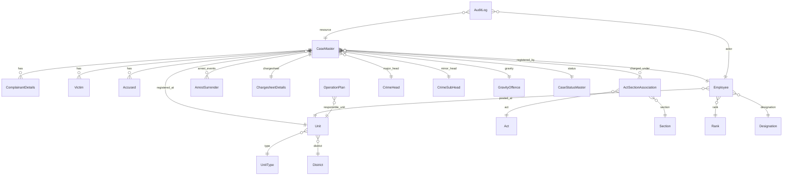

# CODE_GRAPH.md — KSP Trinetra Sentinel Token-Saver Graph Index

> **Version**: 2.0 (Production-Grade FIR Schema Edition)
> **Last Updated**: 2026-07-25
> **Status Legend**: ✅ Implemented | 🔧 Planned (pending approval)

---

## 1. Service Topology

```mermaid
graph TD
    subgraph "Zoho Catalyst — Web Hosting"
        ClientUI["client/src/app/page.tsx ✅"]
    end

    subgraph "Zoho Catalyst — Serverless Functions"
        Gateway["functions/api_gateway/index.js ✅"]
        ZiaFn["functions/catalyst-zia-services ✅"]
        CronFn["functions/hotspot_alert_cron ✅"]
    end

    subgraph "Zoho Catalyst — Datastore"
        DS_CaseMaster["DataStore: CaseMaster ✅"]
        DS_Accused["DataStore: Accused ✅"]
        DS_Victim["DataStore: Victim ✅"]
        DS_AuditLog["DataStore: AuditLog 🔧"]
        DS_OpPlan["DataStore: OperationPlan 🔧"]
    end

    subgraph "PostgreSQL + PostGIS (External DB)"
        PG_FIR["08_ksp_fir_schema.sql — FIR Core Tables ✅🔧"]
        PG_Aux["09_auxiliary_tables.sql — AuditLog, OpPlan 🔧"]
    end

    subgraph "Python ML Service (Docker/FastAPI)"
        PyMain["backend/python-services/api/main.py ✅"]
        PyFIR["backend/python-services/api/fir_analytics.py 🔧"]
        STForecaster["models/st_forecaster.py ✅"]
        GraphEngine["models/graph_engine.py ✅"]
        Forensics["forensics/orchestrator.py ✅"]
    end

    ClientUI -->|REST| Gateway
    Gateway -->|"Auth + RBAC"| AuthMW["functions/api_gateway/auth.js ✅🔧"]
    Gateway -->|"MCP Tool Dispatch"| MCPSrv["functions/api_gateway/mcp_server.js ✅🔧"]
    Gateway -->|"FIR Cases API 🔧"| CasesAPI["functions/api_gateway/api/cases.js 🔧"]
    Gateway -->|"Analytics API 🔧"| AnalyticsAPI["functions/api_gateway/api/analytics.js 🔧"]
    Gateway -->|"Operations API 🔧"| OpsAPI["functions/api_gateway/api/operations.js 🔧"]
    Gateway -->|"Copilot RAG"| RAGOrch["functions/api_gateway/rag_orchestrator.js ✅🔧"]

    MCPSrv -->|"query_fir_database 🔧"| QueryBuilder["functions/api_gateway/query_builder.js 🔧"]
    MCPSrv -->|"explain_section 🔧"| LegalAgent["functions/api_gateway/agents/legal_ethics_agent.js ✅🔧"]
    MCPSrv -->|"get_threat_vector"| HotspotAgent["functions/api_gateway/agents/hotspot_agent.js ✅"]
    MCPSrv -->|"trace_syndicate"| GraphAgent["functions/api_gateway/agents/graph_agent.js ✅"]

    RAGOrch -->|"Intent Classification 🔧"| QueryBuilder
    RAGOrch -->|"Ethics Guard"| EthicsGuard["functions/api_gateway/ethics_guard.js ✅🔧"]

    CasesAPI -->|"SQL (RBAC-scoped)"| DBPool["functions/api_gateway/db.js ✅"]
    AnalyticsAPI -->|SQL| DBPool
    DBPool --> PG_FIR

    Gateway -->|"Proxy /predict"| PyMain
    Gateway -->|"Proxy /graph"| PyMain
    Gateway -->|"Proxy /forensics"| PyMain
    PyMain --> PyFIR
    PyMain --> STForecaster
    PyMain --> GraphEngine
    PyMain --> Forensics

    CasesAPI -->|"AuditLog write"| AuditLogger["functions/api_gateway/audit_logger.js 🔧"]
    AuditLogger --> DS_AuditLog
    AuditLogger --> PG_Aux
```

---

## 2. FIR ER Schema Table Map

---

## 3. Symbol Mapping

| Component | Key File | Exported Symbols | Status |
|---|---|---|---|
| Frontend Shell | `client/src/app/page.tsx` | `Home` | ✅ |
| GeoMap Module | `client/src/components/map/GeoMap.tsx` | `GeoMap` | ✅ |
| Mind Palace Graph | `client/src/components/graph/MindPalaceGraph.tsx` | `MindPalaceGraph` | ✅ |
| Tactical Panel | `client/src/components/advisory/TacticalPanel.tsx` | `TacticalPanel` | ✅ |
| Copilot Sidebar | `client/src/components/chat/NammaRakshaCopilot.tsx` | `NammaRakshaCopilot` | ✅ |
| Forensic Lab | `client/src/components/forensics/ForensicLabModal.tsx` | `ForensicLabModal` | ✅ |
| **DG Snapshot** | `client/src/components/dashboard/DGSnapshot.tsx` | `DGSnapshot` | 🔧 |
| **Case Drill-Down** | `client/src/components/cases/CaseDrillDown.tsx` | `CaseDrillDown` | 🔧 |
| **Victim Journey** | `client/src/components/analytics/VictimJourney.tsx` | `VictimJourney` | 🔧 |
| DB Pool | `functions/api_gateway/db.js` | `query`, `pool` | ✅ |
| Auth Middleware | `functions/api_gateway/auth.js` | `authenticate`, `requireRole`, `maskPII`, `scopeToUnit` | ✅🔧 |
| RBAC Policy | `functions/api_gateway/rbac_policy.js` | `RBAC_POLICY`, `getRolePolicy` | 🔧 |
| MCP Tools Server | `functions/api_gateway/mcp_server.js` | `MCP_TOOLS`, `executeTool` | ✅🔧 |
| RAG Orchestrator | `functions/api_gateway/rag_orchestrator.js` | `orchestrateRAGQuery`, `classifyQueryIntent` | ✅🔧 |
| Query Builder | `functions/api_gateway/query_builder.js` | `buildCaseSearchSQL`, `buildAccusedTraceSQL` | 🔧 |
| Ethics Guard | `functions/api_gateway/ethics_guard.js` | `auditPrompt`, `auditResponse`, `logEthicsDecision` | ✅🔧 |
| Audit Logger | `functions/api_gateway/audit_logger.js` | `logAccess` | 🔧 |
| Cases API | `functions/api_gateway/api/cases.js` | Router | 🔧 |
| Analytics API | `functions/api_gateway/api/analytics.js` | Router | 🔧 |
| Operations API | `functions/api_gateway/api/operations.js` | Router | 🔧 |
| Legal Agent | `functions/api_gateway/agents/legal_ethics_agent.js` | `auditQuery`, `retrieveBNSSections`, `explainSection`, `suggestSections` | ✅🔧 |
| Hotspot Agent | `functions/api_gateway/agents/hotspot_agent.js` | `getForecast` | ✅ |
| Graph Agent | `functions/api_gateway/agents/graph_agent.js` | `traceSyndicate` | ✅ |
| PII Scrubber | `backend/python-services/core/dpdp_scrubber.py` | `PIIScrubber` | ✅ |
| ST Forecaster | `backend/python-services/models/st_forecaster.py` | `predict_hotspots` | ✅ |
| Graph Engine | `backend/python-services/models/graph_engine.py` | `trace_syndicate` | ✅ |
| FIR Analytics | `backend/python-services/api/fir_analytics.py` | `chargesheet_lag`, `victim_journey`, `accused_network` | 🔧 |
| Forensic Orchestrator | `backend/python-services/forensics/orchestrator.py` | `dissect_forensic_case` | ✅ |
| Legal KB Corpus | `db/seeds/legal_knowledge_base.json` | IPC→BNS mappings | 🔧 |

---

## 4. RBAC Clearance Matrix

| Role | Clearance | Case Scope | PII Access | Analytics |
|---|---|---|---|---|
| `CONSTABLE` | 1 | Own unit — limited cols | None | None |
| `IO` | 2 | Own cases + unit aggregate | Partial | Unit |
| `SHO` | 3 | Full unit | Partial | Unit |
| `DCP` | 4 | District | Masked | District |
| `IGP` | 5 | Zone | Masked | Zone |
| `DG` / `HQ_ANALYST` | 6 | State-wide | Full | State |
