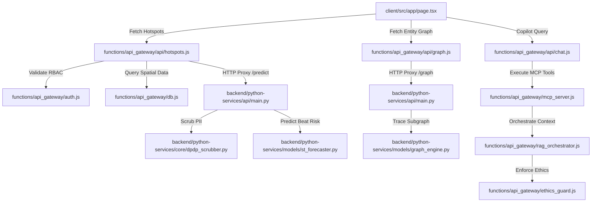

# CODE_GRAPH.md - Trinetra Token Saver Graph Index

This graph maps key module entry points and data flows across the monorepo to maintain minimal context overhead.

## Symbol Mapping

| Component | Key File | Exported Symbols |
|---|---|---|
| Frontend Shell | `client/src/app/page.tsx` | `Home` |
| GeoMap Component | `client/src/components/map/GeoMap.tsx` | `GeoMap` |
| Mind Palace Graph | `client/src/components/graph/MindPalaceGraph.tsx` | `MindPalaceGraph` |
| Tactical Panel | `client/src/components/advisory/TacticalPanel.tsx` | `TacticalPanel` |
| Copilot Sidebar | `client/src/components/chat/CopilotSidebar.tsx` | `CopilotSidebar` |
| DB Pool | `functions/api_gateway/db.js` | `query`, `pool` |
| Auth Middleware | `functions/api_gateway/auth.js` | `authenticate`, `requireRole`, `maskPII` |
| MCP Tools Server | `functions/api_gateway/mcp_server.js` | `tools`, `executeTool` |
| RAG Orchestrator | `functions/api_gateway/rag_orchestrator.js` | `orchestrateRAGQuery` |
| Ethics Guard | `functions/api_gateway/ethics_guard.js` | `auditPrompt`, `auditResponse` |
| PII Scrubber | `backend/python-services/core/dpdp_scrubber.py` | `PIIScrubber` |
| ST Forecaster | `backend/python-services/models/st_forecaster.py` | `predict_hotspots` |
| Graph Engine | `backend/python-services/models/graph_engine.py` | `trace_syndicate` |
