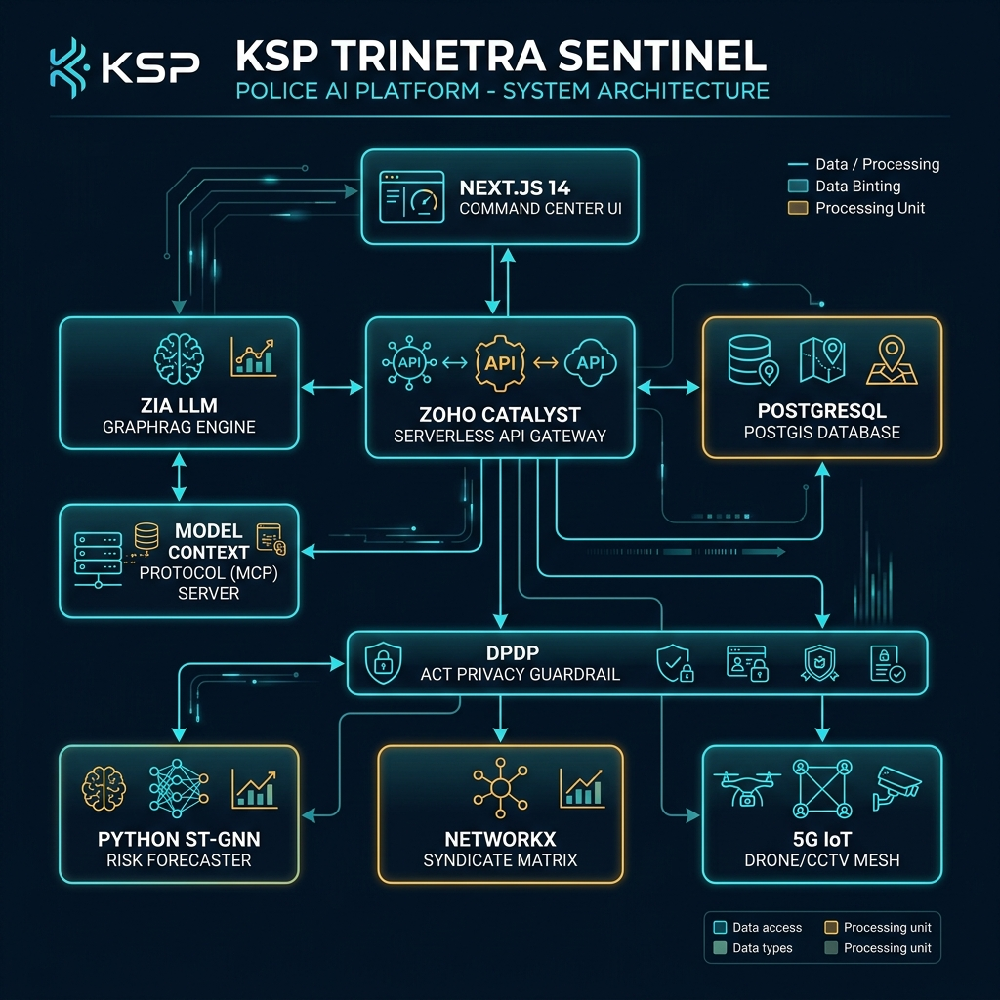
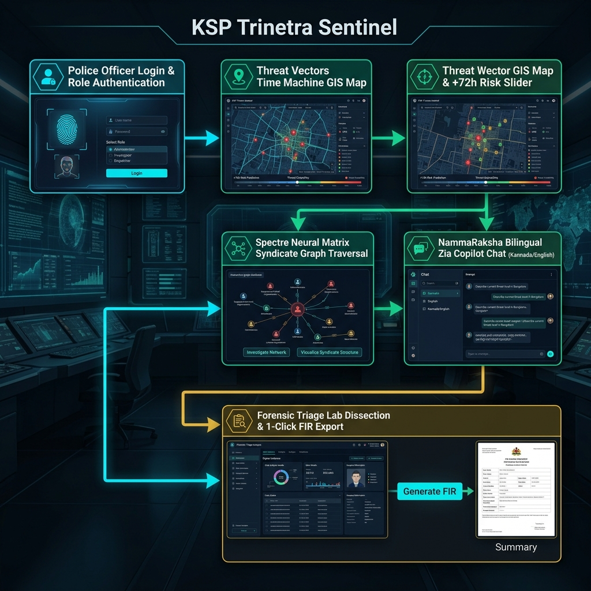

# KSP Trinetra Sentinel 👁️🛡️

> **Karnataka State Police Datathon 2026 - Multi-Layer City Brain & Predictive Law Enforcement Platform**

[]()
[]()
[]()
[]()
[]()
[]()

**KSP Trinetra Sentinel** is an enterprise-grade, multi-agent AI command center and predictive intelligence brain built for the Karnataka State Police (KSP). Powered 100% by the **Zoho Catalyst Platform** and **Zoho Zia LLM Infrastructure**, it combines spatio-temporal risk forecasting, multi-hop syndicate graph tracing, autonomous forensic report dissection, real-time 5G IoT mesh surveillance, and bilingual (Kannada/English) Zia LLM GraphRAG brief generation under strict DPDP Act 2023 privacy guardrails.

---

## 🌐 Live Catalyst Cloud URL

- **Production Access URL**:  
  **[https://ksp-trinetra-sentinel-60079971646.development.catalystserverless.in/app/index.html](https://ksp-trinetra-sentinel-60079971646.development.catalystserverless.in/app/index.html)**
- **Catalyst Project Name**: `KSP-Trinetra-Sentinel`
- **Catalyst Project ID**: `45111000000013054`

---

## 🏛️ System Architecture Diagram



---

## 🔄 User Flow Diagram



---

## ✨ Core Features & Platform Modules

- **📡 Threat Vectors Time Machine (GIS Map)**: Spatio-temporal risk forecasting powered by XGBoost / ST-GNN with an interactive `+72h` time machine slider and beat threat profiling.
- **🔮 Spectre Neural Matrix**: Interactive multi-hop entity relationship graph (Vehicles, IMEIs, Mule Accounts, Suspects, FIRs) using NetworkX syndicate algorithms.
- **⚡ What-If Tactical Advisory Panel**: Counterfactual simulation engine evaluating patrol deployments, ANPR checkpoints, and predicting up to `64%` risk reduction.
- **💬 NammaRaksha Law Enforcement Copilot**: Powered by **Zoho QuickML GLM-4.7-Flash (30B MoE)** and parallel agent fan-out. Bilingual (ಕನ್ನಡ ⇄ English) Zia GraphRAG brief generator trained on Bharatiya Nyaya Sanhita (BNS 2023) legal codes with live thinking traces.
- **🗄️ Full 12-Table Police FIR ER Schema in Zoho Catalyst Data Store**: Native NoSQL document storage for `CaseMaster`, `Accused`, `Victim`, `Person`, `ActSectionAssociation`, `ChargesheetDetails`, `PoliceStation`, `CrimeHead`, `Employee`, `AuditLog`, `OperationPlan`, and `DashboardPreset`.
- **🔬 Forensic Triage & Contradiction Lab**: Multi-agent report dissection engine (Pathology, Digital, Trace Evidence) identifying timeline discrepancies between witness statements and medical autopsy windows.
- **🚁 IoT Tactical Surveillance & Traffic Control**: Live telemetry feeds for SkyWatch FLIR Drones, CCTV ANPR Nodes, ShotSpotter Acoustic Sensors, and Emergency Green Corridor Traffic Signal Automation.
- **🛡️ Public Vigilance & Self-Defence Portal**: Emergency Police SOS Helpline (112 / 1930), self-defence & cyber fraud guides, privacy FAQs, and system settings.
- **🌓 Dual Theme Support (Light ☀️ & Dark 🌙)**: High-contrast, glassmorphic frosted UI with instant theme switching.


---

## 🚀 Quick Start & Local Execution

### Prerequisites
- **Node.js**: v18.x or higher
- **Python**: v3.10 or higher
- **PowerShell** (Windows) or **Bash** (Linux/macOS)

### 1. Launch All Local Services
Run the automated one-click launcher (automatically cleans up stale processes on ports 8000, 3001, 3000):

- **Windows PowerShell**:
  ```powershell
  .\scripts\deploy_catalyst.ps1
  ```
- **Linux/macOS Bash**:
  ```bash
  chmod +x scripts/run_local.sh
  ./scripts/run_local.sh
  ```

### 2. Access Local Services
- **Command Center UI**: `http://localhost:3000`
- **Zoho Catalyst API Gateway**: `http://localhost:3001/api/health`
- **Python ML FastAPI Engine**: `http://localhost:8000/docs`

---

## 🧪 Automated Testing

### 1. Run Node.js MCP & Agent Test Suite
```bash
node functions/api_gateway/tests/test_mcp_tools.js
```

### 2. Run Python Multi-Agent Forensic Test Suite
```bash
cd backend/python-services
python -m pytest tests/test_forensics.py
```

### 3. Run Full Integration Test Script
```bash
python scripts/test_zia_agents.py
```

---

## ☁️ Deployment to Zoho Catalyst

Build static Next.js production bundle and deploy to Zoho Catalyst Cloud:

- **Windows PowerShell**:
  ```powershell
  .\scripts\deploy_catalyst.ps1
  ```
- **Linux/macOS Bash**:
  ```bash
  ./scripts/deploy_catalyst.sh
  ```

---

## 📱 Mobile App Deployment (Android APK & iOS IPA)

KSP Trinetra Sentinel includes native cross-platform mobile support via **Capacitor**.

### 1. Build Mobile Web Bundle & Sync Native Assets
```bash
cd client
npm run build:mobile
```

### 2. Generate Android APK / AAB Binary (Android Studio)
```bash
# Open Android Studio project directly
npx cap open android
```
In Android Studio:
* Click **Build → Build Bundle(s) / APK(s) → Build APK(s)**
* Binary Output: `client/android/app/build/outputs/apk/debug/app-debug.apk`

### 3. Generate iOS IPA Binary (Xcode - macOS)
```bash
# Add iOS project files (macOS only)
npx cap add ios

# Open Xcode project directly
npx cap open ios
```
In Xcode:
* Select Product → Archive → Distribute App → Development / Enterprise IPA.

---

## 🔒 Security & Compliance


- **Zoho Catalyst Vault**: Secure environment variable and secret token management (Google Secret Manager equivalent).
- **DPDP Act 2023 Compliance**: PII scrubbing (phone numbers, Aadhaar, PAN) via salted SHA-256 hashing.
- **OWASP Security**: Configured CORS policy, `nosniff`, `DENY` frame options, and HSTS headers.

---

## 📜 License

This project is licensed under the MIT License - see the [LICENSE](file:///d:/Siva/Books/CAREER/HACKATHON/ksp-trinetra-sentinel/LICENSE) file for details.
