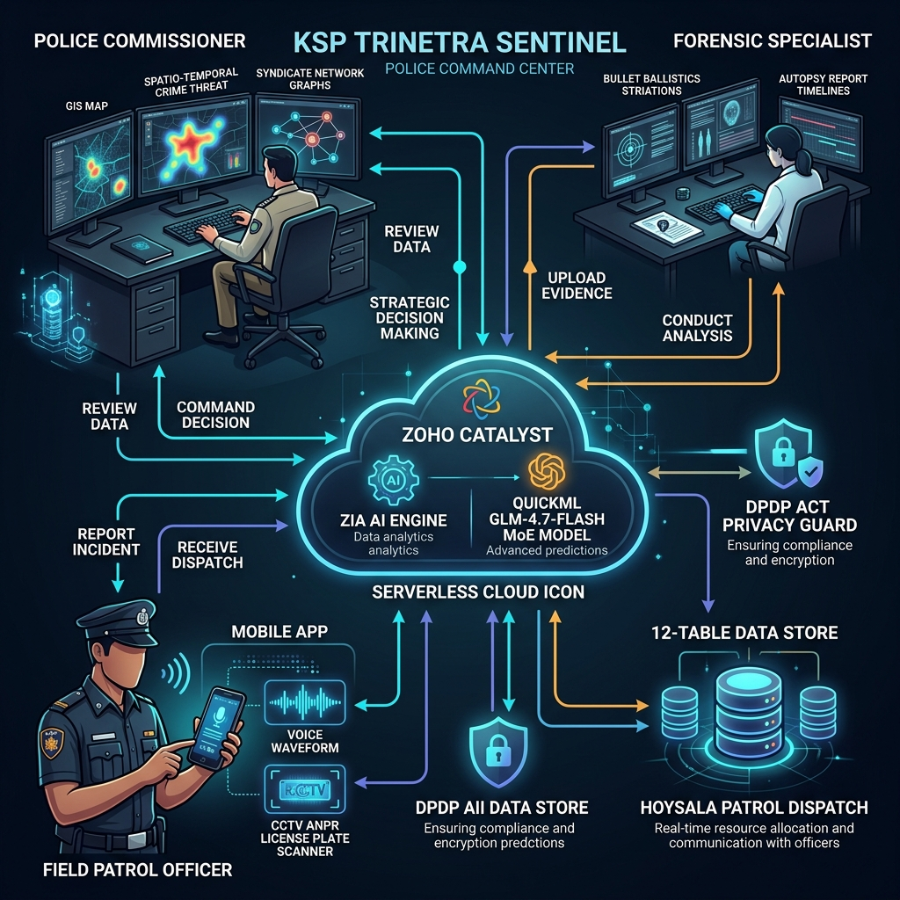

# KSP Trinetra Sentinel — Production Architecture

> **Version**: 2.0 | **Deployed on**: Zoho Catalyst | **Schema**: FIR ER v2 (KSP Datathon 2026)

## System Overview

```
┌─────────────────────────────────────────────────────────────────────────────┐
│                    KSP OFFICER BROWSER (Next.js 14)                         │
│  DGSnapshot │ CaseDrillDown │ VictimJourney │ GeoMap │ MindPalace │ Copilot │
└────────────────────────────┬────────────────────────────────────────────────┘
                             │ HTTPS (Catalyst CDN)
┌────────────────────────────▼────────────────────────────────────────────────┐
│              ZOHO CATALYST SERVERLESS — api_gateway/index.js                │
│                                                                             │
│  Auth (JWT/Header) → RBAC Policy → Ethics Guard → Route Dispatch           │
│                                                                             │
│  /api/v1/cases/*        /api/v1/analytics/*      /api/v1/operations/*      │
│  /api/hotspots/forecast /api/graph/story          /api/chat (Copilot)      │
│  /api/multimodal        /api/v1/legal/*                                    │
└───────────┬─────────────────────────┬───────────────────────────────────────┘
            │                         │
    ┌───────▼────────┐    ┌───────────▼────────────────────────────────┐
    │  PostgreSQL     │    │   Python FastAPI ML Engine (Catalyst Adv.) │
    │  + PostGIS      │    │                                            │
    │  FIR ER Schema  │    │  /api/v1/fir/analytics/chargesheet-lag     │
    │  (08 + 09 SQL)  │    │  /api/v1/fir/analytics/victim-journey      │
    │                 │    │  /api/v1/fir/analytics/accused-network     │
    │  audit_log      │    │  /api/v1/forecasts/hotspot                 │
    │  operation_plan │    │  /api/v1/forensics/dissect  (Task 06)      │
    └─────────────────┘    └────────────────────────────────────────────┘
```

## Use-Case Diagram — Actor Roles & Command Center Interactions



## Service Topology


| Service | Runtime | Hosting | Purpose |
|---|---|---|---|
| `api_gateway/` | Node.js 18 (Express) | Catalyst Advanced I/O | REST API + Concurrent Sub-Agent Orchestrator + Zia Copilot |
| `client/` | Next.js 14 (Static Export) | Catalyst Static Hosting | Officer Command Center UI |
| `backend/python-services/` | Python 3.11 (FastAPI) | Catalyst Advanced I/O | ML Analytics + Forensics Triage |
| **Zoho QuickML GLM-4.7-Flash** | **GLM-4.7 MoE (30B IT)** | **Zoho QuickML (India DC)** | **Zia Generative Copilot & Chain-of-Thought Reasoning** |
| PostgreSQL + PostGIS | Managed DB | External (supabase/self-hosted) | FIR ER Schema source of truth (relational) |
| **Catalyst Datastore** | **Zoho NoSQL Document Store** | **Catalyst Datastore** | **Full 12-Table FIR ER Schema (`CaseMaster`, `Accused`, `Victim`, `Person`, `ActSectionAssociation`, `ChargesheetDetails`, `PoliceStation`, `CrimeHead`, `Employee`, `AuditLog`, `OperationPlan`, `DashboardPreset`)** |
| Catalyst Cache | In-memory (5 min TTL) | Catalyst Cache | Hotspot forecasts, DG snapshot |
| Data Storage | Local & Stratus | `data/sample_test_images` | Sample evidence & test files |
| **Native Mobile Apps** | **Capacitor Cross-Platform** | **Android APK / iOS IPA** | **Patrol Officer Handheld App (Camera, Voice, Geolocation)** |


## Request Lifecycle — Copilot Query

```
Officer sends NL query
        │
        ▼
[Ethics Guard] ─── Constitutional violation? → 403 + ETHICS_BLOCK audit entry
        │ allowed
        ▼
[Intent Classifier] ─── CASE_SEARCH | ACCUSED_TRACE | LEGAL_EXPLAIN | ANALYTICS_SNAPSHOT | ...
        │
        ▼
[scopeToUnit()] ─── Inject RBAC WHERE clause (OWN_UNIT | DISTRICT | STATE_WIDE)
        │
        ▼
[Query Builder] ─── Parameterized SQL with scope params first
        │
        ▼
[PostgreSQL FIR DB] ─── Query executes with RBAC scope
        │
        ▼
[PII Masker] ─── Apply mask tier (FULL_REDACT | PARTIAL | STANDARD | UNMASKED)
        │
        ▼
[Zoho QuickML GLM-4.7-Flash] ─── MoE LLM NLG Synthesis + Chain-of-Thought (enable_thinking: true)
        │
        ▼
[Audit Logger] ─── Non-blocking write to audit_log (Postgres + Catalyst Datastore)
        │
        ▼
Structured JSON response with ZIA_GLM badge, latency, & thinking trace to client
```


## Data Layer — FIR ER Schema (Summary)

**Core Tables (08_ksp_fir_schema.sql)**:
- `State`, `District` — geographic hierarchy
- `Rank`, `Designation` — officer hierarchy (clearance levels 1–6)
- `UnitType`, `Unit` — police station hierarchy
- `Employee` — officer registry (FK: Rank, Designation, Unit)
- `CrimeHead`, `CrimeSubHead` — crime classification tree
- `Act`, `Section` — legal act/section registry
- `CaseMaster` — FIR master record
- `Accused`, `Victim`, `Person` — parties to the case
- `ArrestSurrender` — arrest milestones
- `ActSectionAssociation` — case ↔ section many-to-many (IPC/BNS dual)
- `CrimeHeadActSection` — canonical crime head → section mapping
- `ChargesheetDetails` — chargesheet milestone per case
- `CaseStatusMaster`, `GravityOffence` — reference / lookup tables

**Auxiliary Tables (09_auxiliary_tables.sql)**:
- `audit_log` — tamper-evident officer access log
- `operation_plan` — structured patrol operation plans
- `dashboard_preset` — saved filter presets per officer
- `legal_knowledge_base` — IPC↔BNS section mapping corpus (65+ entries)
- `case_connection` — cross-case links (common accused/vehicle/account)

## Security Layers

1. **Catalyst JWT Authentication** — Zoho identity assertion
2. **RBAC Policy** (`rbac_policy.js`) — 14 roles, clearance levels 1–6
3. **SQL Scope Injection** (`scopeToUnit()`) — data-layer scoping, not just middleware trust
4. **PII Masking** — 4 tiers per clearance level (FULL_REDACT → UNMASKED)
5. **DPDP Act 2023 Compliance** — constitutional profiling guardrails in Ethics Guard
6. **Audit Logger** — tamper-evident dual-write (Postgres primary, Catalyst Datastore backup)
7. **Secrets Management** — all credentials via Catalyst Vault / env vars (never hardcoded)
8. **ASSISTIVE_ONLY Labels** — all legal section suggestions carry mandatory officer verification notice
